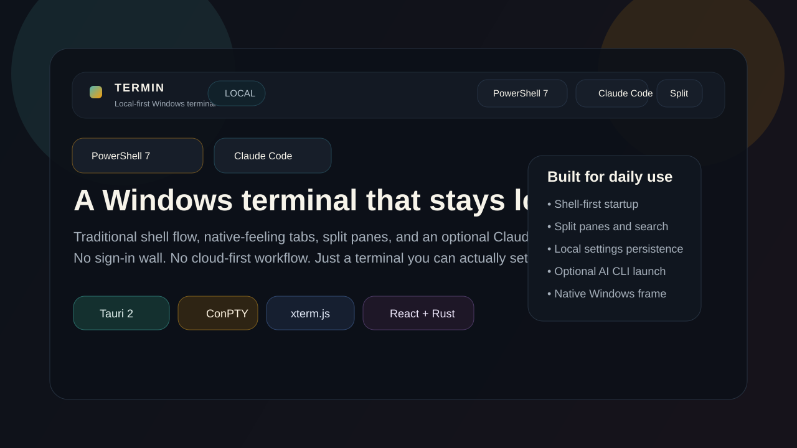
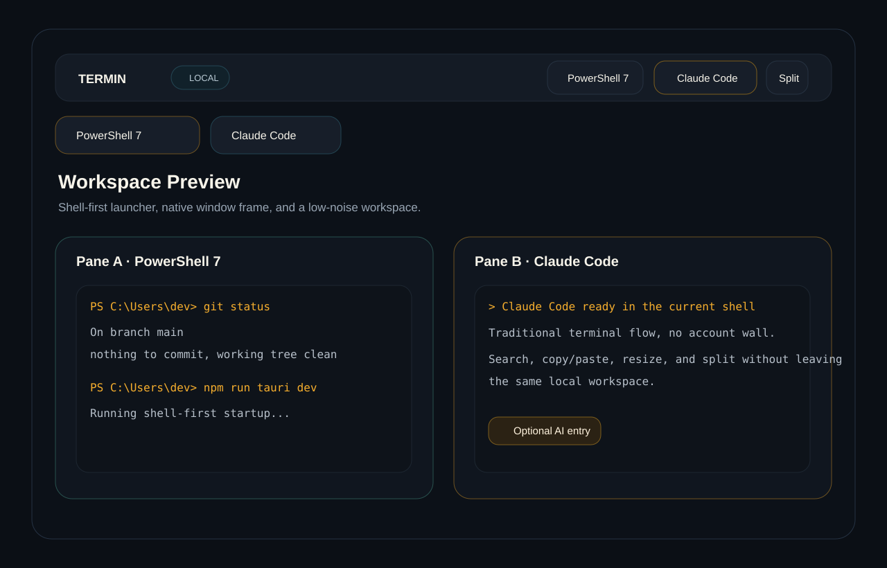

# SlateTerm

Local-first Windows terminal built with Tauri, Rust, React, and xterm.js.



SlateTerm is a local-first, workspace-aware AI terminal for Windows. It keeps the terminal as the primary surface while adding project context, visible AI runtime state, and native Windows integration around local AI coding tools.

## Current Focus

- Windows-first, workspace-aware AI terminal
- Terminal-dominant xterm.js workflow with optional PowerShell command blocks
- Claude Code sessions with visible runtime state and workspace CWD
- PowerShell 7 and Command Prompt as first-class local shells
- Native-feeling tabs, split panes, project context, image attachments, search, copy/paste, and local settings
- Optional completion chime for Claude replies and local remote attach for a second terminal

## Stack

- Tauri 2
- Rust
- React
- Vite
- xterm.js
- ConPTY via `portable-pty`

## Snapshot



Highlights:

- Fast shell-first startup with Claude Code available as a first-class AI runtime
- PowerShell 7 and Command Prompt as primary local shell targets
- Persistent Shell/Claude status in tabs and the active workspace context bar
- Native-feeling tabs, split panes, named workspaces, command palette, and local settings persistence
- PowerShell Shell Integration for structured command blocks, CWD tracking, and exit status
- Completion chime driven by Claude Code's title state, plus remote attach into a live Claude session

## What Works Today

- Open a shell tab from the top launcher
- Split the active tab into two panes
- Resize panes with the splitter
- Search terminal output
- Open terminal URLs with Ctrl+click in the default browser
- Use smart `Ctrl+V` while Claude Code is running: SlateTerm detects Claude even when it was started manually from a shell, pastes text normally, and routes images through Claude's Windows `Alt+V` action
- Pick an image from Windows clipboard history to attach it directly while Claude Code is running
- Drag files or folders into a Claude Code pane to queue path attachment chips for the next prompt; ordinary shell panes receive safely quoted absolute paths directly
- Use `Ctrl+Shift+V` or `Shift+Insert` to explicitly paste clipboard text or an image file path in ordinary shells
- Open workspace-aware shell or Claude Code tabs with the selected folder as their verified working directory
- Save and restore named workspaces
- Search, copy, and replay command history from the command palette
- Inspect, collapse, copy, and rerun PowerShell command blocks in a non-blocking right-side drawer
- Read each pane's runtime, session status, title, and working directory from a compact persistent pane header
- Use consistent keyboard-dismissable command, history, settings, and file-preview overlays
- Persist theme, font, cursor, and startup shell settings locally
- Play a short chime when a Claude Code reply finishes (toggleable, off in the command palette or settings)
- Share a running Claude session with another local terminal through `slateterm-attach`
- Launch, continue, or resume `Claude Code` when it is installed on the machine

## Deliberate Non-Goals For This MVP

- No account system
- No cloud sync
- No cloud-hosted AI runtime; SlateTerm integrates local AI terminal tools instead
- No plugin system
- No cross-platform scope yet

## Completion Chime

SlateTerm plays a two-note chime when a Claude Code reply finishes, so you can look
away while waiting. It only fires for Claude panes, never for plain shells.

Claude Code signals "working" through its rotating terminal-title glyph and returns to
a stable `✳` when idle, so SlateTerm watches the title and waits for that glyph to
settle. It also listens for the terminal bell as a second trigger, which Claude Code
emits when configured to:

```bash
claude config set --global preferredNotifChannel terminal_bell
```

Turn it off with the `Play a chime when Claude Code finishes a reply` checkbox in
settings, or the `Mute Claude completion chime` command in the command palette.

## Remote Attach

Remote attach lets a second terminal window on the same PC watch and type into a
running Claude session — for example the terminal that UU Remote opens for you.

Turn on **Settings → Remote attach** (or the command palette toggle), then use the
command palette entry **Remote attach 使用说明** to get a copyable command. Paste
that into the other terminal:

```powershell
& "$env:LOCALAPPDATA\SlateTerm\slateterm-attach-1.1.2.exe"
```

The first time you switch remote attach on, SlateTerm writes that executable out of
itself into `%LOCALAPPDATA%\SlateTerm\` — the download is a single file, and nothing
needs to be built or unpacked. The file name carries the app version, so an upgrade
starts from a fresh copy instead of reusing whatever the previous version released.

With more than one Claude session open it lists them numbered; otherwise it connects
straight away. `Ctrl+]` detaches, and the SlateTerm pane keeps running untouched.
`Ctrl+C` is passed through to Claude rather than detached.

Claude Code runs on the alternate screen, and the Windows console keeps no scrollback
for it, so the remote window cannot scroll back through history — use the SlateTerm
pane for that. Typing works normally.

Step-by-step instructions and a copy button live in the command palette under
**Remote attach 使用说明**; the settings panel only holds the switch and the
connection command itself.

Only panes running a Claude runtime are shareable — plain PowerShell and `cmd`
panes are never exposed. The pipe is created with a DACL limited to your Windows
account and network clients are rejected, and each enable uses a fresh pipe name and
random token written to `%LOCALAPPDATA%\SlateTerm\remote.json`, which is deleted on
disable. Remote attach is off by default. Any process running as the same user can
still inject input while it is enabled, so keep it off unless you are using it.

## Why the client is a separate process

Even though only one file is downloaded, remote attach still runs as its own
process. The reason is the Windows console: the client must take over the terminal
window UU Remote opened — raw VT input mode, `ReadConsoleW`, and full ownership of
stdout. The main app is a **windows-subsystem** binary (Tauri's WebView process) and
has no console at all, so it has nowhere to send that output.

The subsystem is decided at link time, so a single executable cannot be both. The
practical workaround is to embed the client's bytes inside the main executable and
release them on first use, which keeps the download to one file while the two
processes stay separate. `src-tauri/build.rs` performs the embedding; if the client
has not been compiled yet it embeds nothing and SlateTerm falls back to looking for
`slateterm-attach.exe` next to itself, so development builds and older layouts keep
working.

## Development

Requirements:

- Node.js 20 or newer
- pnpm 10 or newer (`corepack enable` can provide it with supported Node.js installations)
- Rust toolchain
- Tauri prerequisites for Windows
- PowerShell 7 recommended

Install dependencies:

```bash
pnpm install --frozen-lockfile
```

Run the desktop app in development:

```bash
pnpm tauri dev
```

Run only the Vite frontend:

```bash
pnpm dev
```

Build the frontend bundle:

```bash
pnpm build
```

Build the remote attach client on its own (rarely needed — `cargo build` and
`pnpm tauri dev` already compile every target in the crate; the release workflow
builds it explicitly **before** the main binary so it can be embedded first):

```bash
pnpm build:attach
```

This passes `--release`, because `build.rs` embeds the client from
`target/<profile>/` and the shipped binary is a release build. Building it in
debug only puts it in `target/debug/`, where the release build will not look, and
the embed then silently embeds nothing. The release workflow additionally scans
the built `slateterm.exe` for the client's `--help` text so that case fails the
build instead of shipping a program whose Remote attach never works.

Build the desktop application:

```bash
pnpm tauri build
```

Bundling is currently switched off (`bundle.active` is `false` in
`src-tauri/tauri.conf.json`). Releases distribute a single executable instead: the
attach client is embedded into `slateterm.exe` at build time and released to
`%LOCALAPPDATA%\SlateTerm\` on first use, so one download is enough.

## Repository Notes

- pnpm is the required JavaScript package manager; `pnpm-lock.yaml` is the only dependency lock file.
- The repo ignores local build output such as `node_modules`, `dist`, and `src-tauri/target`.
- Current app version is `1.1.2`.
- Startup remains optimized around opening a local shell quickly, while AI runtimes are treated as visible, workspace-aware terminal sessions.

## License

SlateTerm is released under the [MIT License](LICENSE).

## Near-Term Direction

- Make startup feel faster and quieter on Windows
- Keep the top toolbar clean and low-friction
- Improve scroll behavior and pane ergonomics
- Refine shell and AI profile handling without bloating the UI

